# Rol.IA — Inteligencia Comercial Autónoma

Plataforma de inteligencia comercial que monitorea leads en tiempo real, interviene automáticamente cuando un asesor humano no responde a tiempo, y proporciona análisis de rendimiento publicitario con proyecciones de ventas.

---

## Tabla de Contenidos

- [Acceso a la Plataforma](#acceso-a-la-plataforma)
- [Centro de Comando (Dashboard)](#centro-de-comando-dashboard)
- [Flujo Automatizado de Leads (G1)](#flujo-automatizado-de-leads-g1)
- [Semáforo de Abandono](#semáforo-de-abandono)
- [Sistema de Guardianes](#sistema-de-guardianes)
- [Reportes de Inteligencia](#reportes-de-inteligencia)
- [Bóveda de Seguridad](#bóveda-de-seguridad)
- [Configuración](#configuración)
- [Panel de Administración](#panel-de-administración)

---

## Acceso a la Plataforma

Cada usuario nuevo debe pasar por un proceso de registro con verificación en dos pasos antes de acceder.

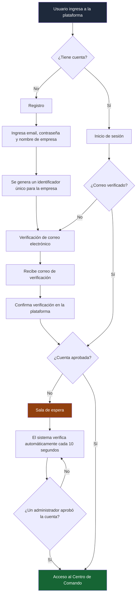

**Roles disponibles:**
| Rol | Acceso |
|-----|--------|
| **Dueño** | Todo el panel de su empresa + bóveda de seguridad |
| **Admin** | Dashboard + configuración + bóveda |
| **Analista** | Dashboard + reportes (solo lectura) |
| **Viewer** | Dashboard (solo lectura) |
| **Superadmin** | Todo + panel de administración global |

---

## Centro de Comando (Dashboard)

La vista principal se organiza en tres secciones con indicadores clave siempre visibles en la parte superior.

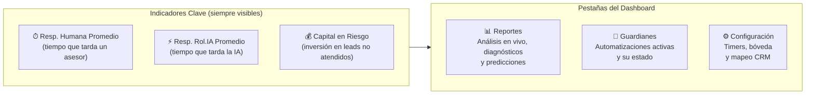

---

## Flujo Automatizado de Leads (G1)

El flujo principal de la plataforma. Cuando un lead nuevo ingresa desde el CRM, se inicia un proceso automatizado que busca rescatar al lead si ningún asesor humano lo atiende a tiempo.

### Flujo completo paso a paso

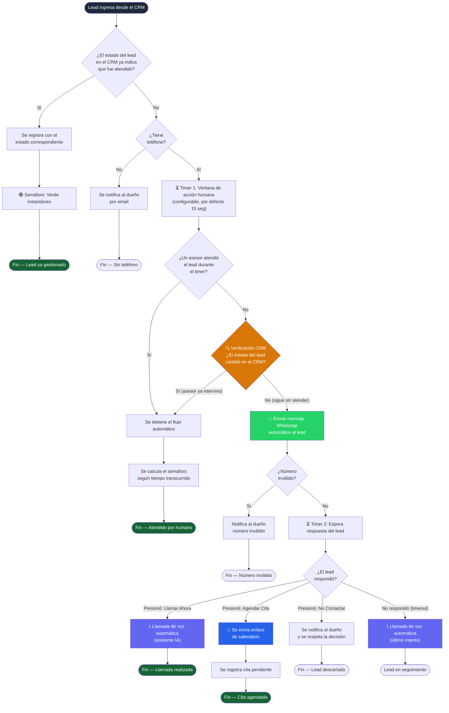

### Detalle del mensaje WhatsApp

El lead recibe un mensaje de plantilla con tres botones de acción rápida:

```
┌─────────────────────────────────────────┐
│  Hola {nombre},                         │
│                                         │
│  Queremos ayudarte con tu consulta.     │
│  ¿Cómo prefieres que te contactemos?    │
│                                         │
│  ┌─────────────┐ ┌──────────────┐       │
│  │ Llamar Ahora│ │ Agendar Cita │       │
│  └─────────────┘ └──────────────┘       │
│  ┌───────────────┐                      │
│  │ No Contactar  │                      │
│  └───────────────┘                      │
└─────────────────────────────────────────┘
```

### Limpieza automática

Los leads que permanecen en flujo activo por más de **12 horas** sin resolución son cerrados automáticamente con un evento de timeout.

---

## Semáforo de Abandono

Sistema visual que monitorea en tiempo real cuánto tiempo llevan los leads sin ser atendidos. Funciona como un indicador de urgencia para el equipo comercial.

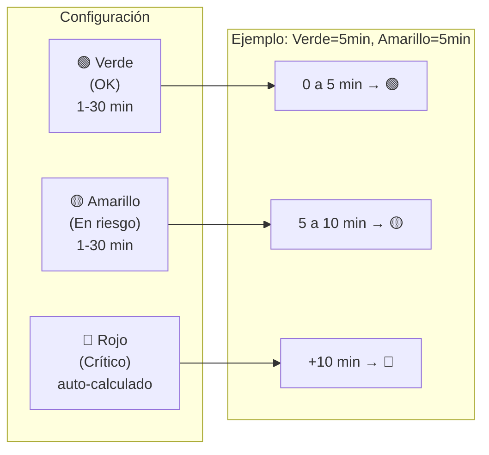

**Cómo se detiene el semáforo:**
- Cuando el CRM reporta un cambio de estado (un asesor atendió al lead)
- El tiempo transcurrido se registra y se asigna el color correspondiente
- Los leads ya atendidos aparecen en el historial con su color final

**Vista en el dashboard:**

```
┌──────────────────────────────────────────────────┐
│  Semáforo de Abandono              2🔴  3🟡      │
├──────────────────────────────────────────────────┤
│  Lead          Fuente      Estado      Tiempo    │
│  ─────────────────────────────────────────────── │
│  Juan Pérez    Meta Ads    🔴 Crítico  12:34     │
│  Ana López     Google      🟡 Riesgo    7:21     │
│  Carlos R.     Clientify   🟢 OK        2:15     │
│  María G.      Meta Ads    🟢 OK        0:45     │
└──────────────────────────────────────────────────┘
```

Los tiempos se actualizan en vivo cada segundo para los leads activos.

---

## Sistema de Guardianes

La plataforma cuenta con 7 guardianes autónomos, cada uno especializado en un aspecto del proceso comercial. Cada guardián puede estar en modo **Activo** (interviene automáticamente) u **Observador** (solo registra datos sin actuar).

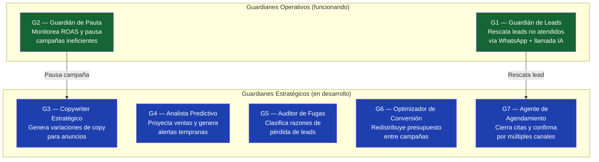

### G1 — Guardián de Leads (Detalle)

El G1 muestra su progreso en un stepper visual de 5 pasos:

```
  ●──────────●──────────●──────────●──────────●
  CRM        Mensaje    Espera     Llamada    Cita
  Check      Enviado    N min      de Voz     Agendada
  ✅          ✅          ⏳
```

Incluye la **Bitácora Rol.IA**: un registro en tiempo real de cada acción tomada por el sistema (webhooks recibidos, mensajes enviados, llamadas realizadas, citas agendadas).

### G2 — Guardián de Pauta (Detalle)

Monitorea el ROAS (retorno sobre inversión publicitaria) en tiempo real:

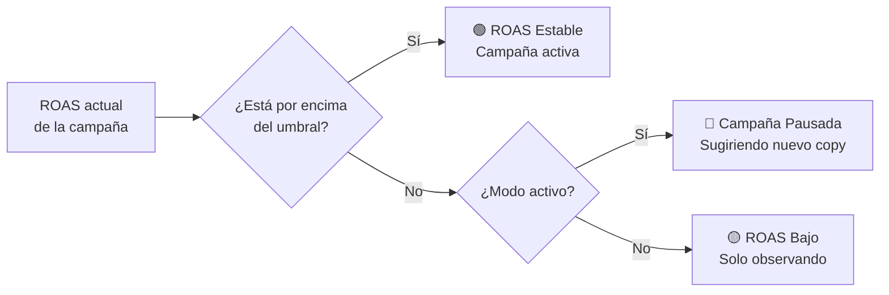

### Historial de Rescates

Comparación forense entre la acción (o inacción) del equipo humano vs la intervención automática de Rol.IA:

```
┌─────────────────────────────────────────────────┐
│  Bitácora Forense                               │
├─────────┬───────────────────┬───────────────────┤
│  Hora   │  Humano           │  Rol.IA           │
├─────────┼───────────────────┼───────────────────┤
│  10:32  │  ✗ Sin respuesta  │  ✓ WhatsApp auto  │
│  10:47  │  ✗ Sin respuesta  │  ✓ Llamada VAPI   │
│  11:15  │  ✗ Sin respuesta  │  ✓ Cita agendada  │
└─────────┴───────────────────┴───────────────────┘
```

---

## Reportes de Inteligencia

Organizados en tres categorías según su naturaleza temporal.

### Reportes en Vivo (tiempo real)

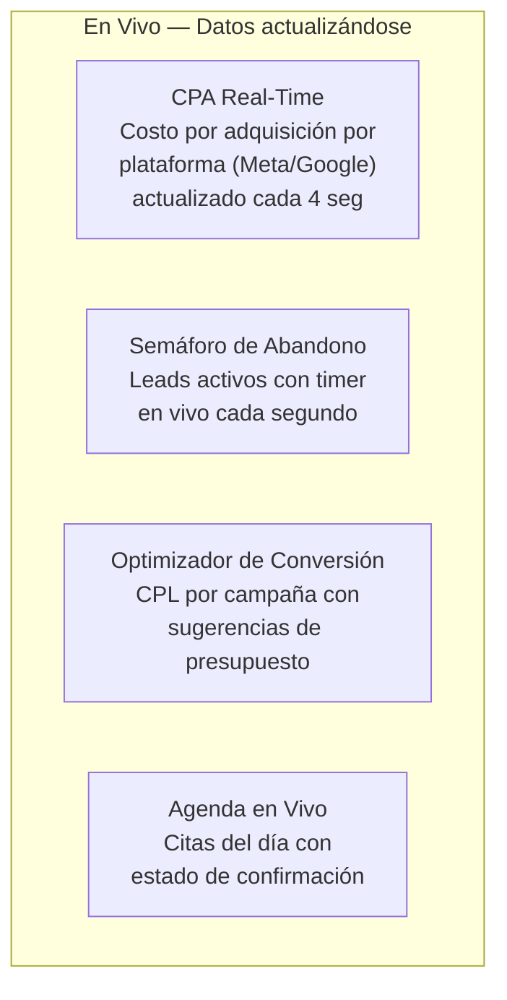

| Reporte | Qué muestra | Actualización |
|---------|-------------|---------------|
| **CPA Real-Time** | Gasto e inversión por plataforma publicitaria en intervalos de 10 minutos | Cada 4 segundos |
| **Semáforo de Abandono** | Leads activos ordenados por tiempo de espera con colores de urgencia | Cada 15 segundos + timer local |
| **Optimizador de Conversión** | Costo por lead de cada campaña, tendencia y presupuesto sugerido | Bajo demanda |
| **Agenda en Vivo** | Citas agendadas hoy con canal, estado y agente asignado | Bajo demanda |

### Reportes de Diagnóstico (análisis)

| Reporte | Qué muestra |
|---------|-------------|
| **Diagnóstico de Fuga** | Mapa de burbujas con las razones por las que se pierden leads (frecuencia vs impacto) |
| **Copywriter IA** | Variaciones de copy generadas por IA con puntaje de engagement y brief visual para el diseñador |
| **Tendencia ROAS Semanal** | Comparativa de retorno publicitario Meta vs Google en los últimos 7 días con línea de corte |

### Reporte Predictivo (forecasting)

| Reporte | Qué muestra |
|---------|-------------|
| **Predictor de Metas** | Ventas reales vs proyección IA vs meta mensual. Indica si se alcanzará el objetivo |

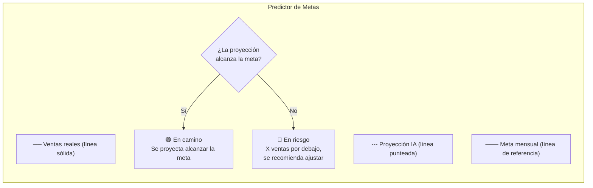

---

## Bóveda de Seguridad

Sistema protegido por PIN donde cada empresa almacena las credenciales de sus integraciones externas.

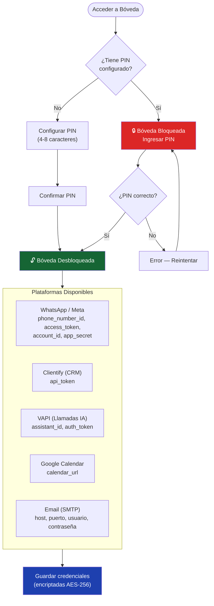

**Características:**
- Las credenciales se muestran enmascaradas (solo últimos 4 caracteres visibles)
- Botón para revelar/ocultar cada campo
- Solo usuarios con rol Dueño, Admin o Superadmin pueden modificar credenciales
- El Superadmin puede resetear el PIN de cualquier empresa

---

## Configuración

### Estrategia de Guardianes

Parámetros que controlan el comportamiento del flujo automatizado:

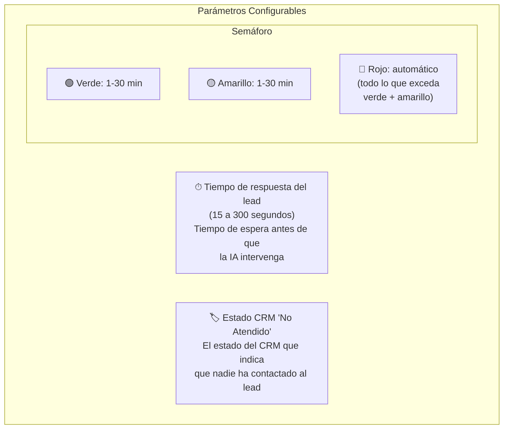

### Mapeo de Estados CRM

Permite traducir los estados del CRM externo a los estados internos de la plataforma:

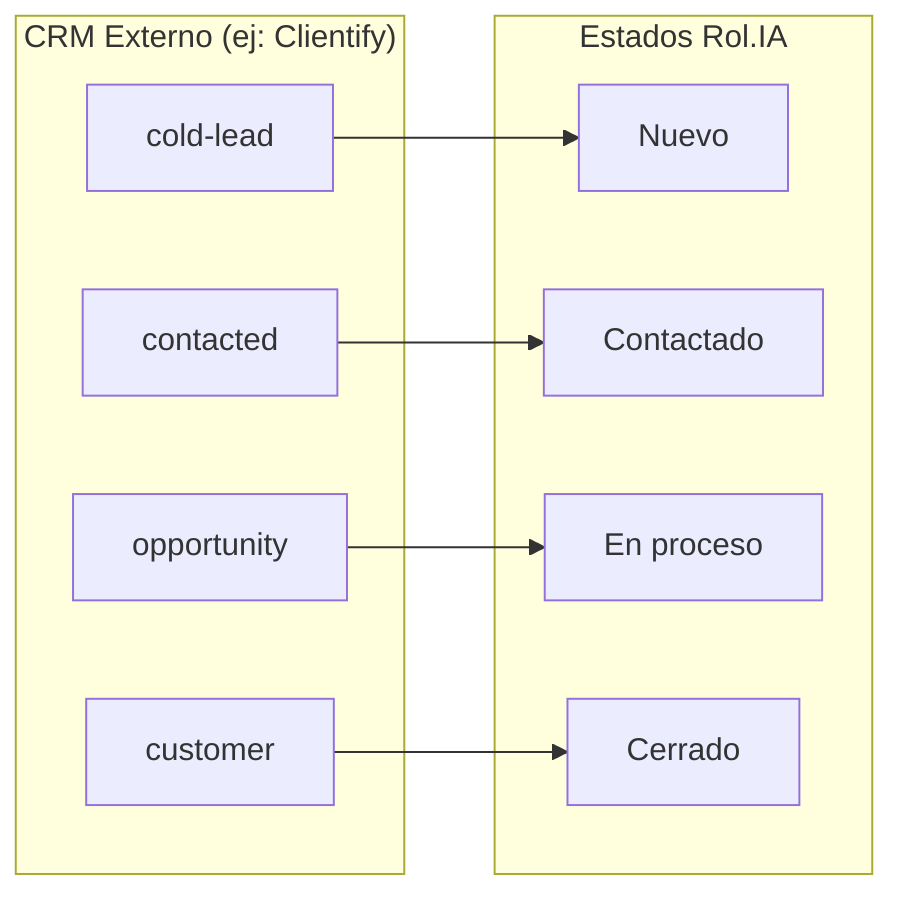

Cada empresa configura su propio mapeo según los estados que use su CRM.

### Historial de Webhooks

Registro auditable de todos los webhooks recibidos con filtros por fuente (Clientify, Meta) y paginación. Muestra fecha, fuente, estado CRM recibido y acción tomada (creado, actualizado, ignorado, error).

---

## Panel de Administración

Accesible solo para el Superadmin. Gestiona usuarios, empresas y plataformas de integración.

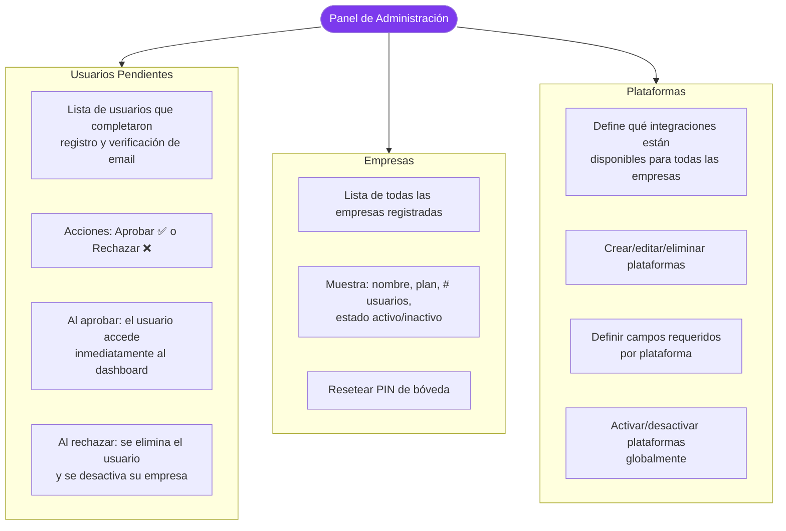

### Flujo de gestión de plataformas

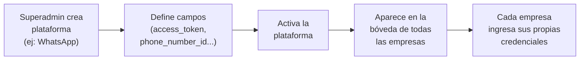

---

## Flujo General de la Plataforma

Vista consolidada de cómo interactúan todos los componentes:

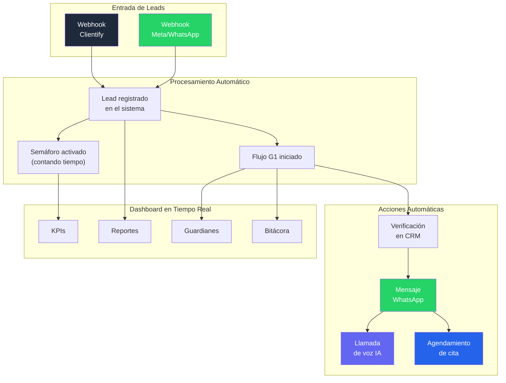
